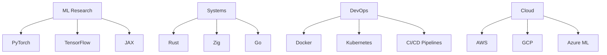

  <h1 align="center">👨‍💻 Machine Learning Researcher & Software Developer</h1>
  
  

    
  

  
   
  
  

    
    
    
    
  

```mermaid
graph TD
    A[ML Research] --> B[PyTorch]
    A --> C[TensorFlow]
    A --> D[JAX]
    
    E[Systems] --> F[Rust]
    E --> G[Zig]
    E --> H[Go]
    
    I[DevOps] --> J[Docker]
    I --> K[Kubernetes]
    I --> L[CI/CD Pipelines]
    
    M[Cloud] --> N[AWS]
    M --> O[GCP]
    M --> P[Azure ML]
```
